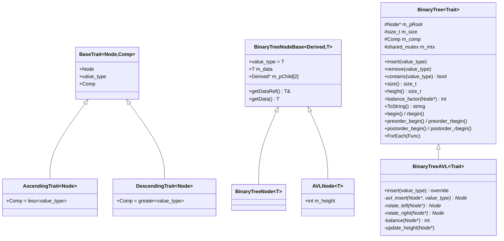
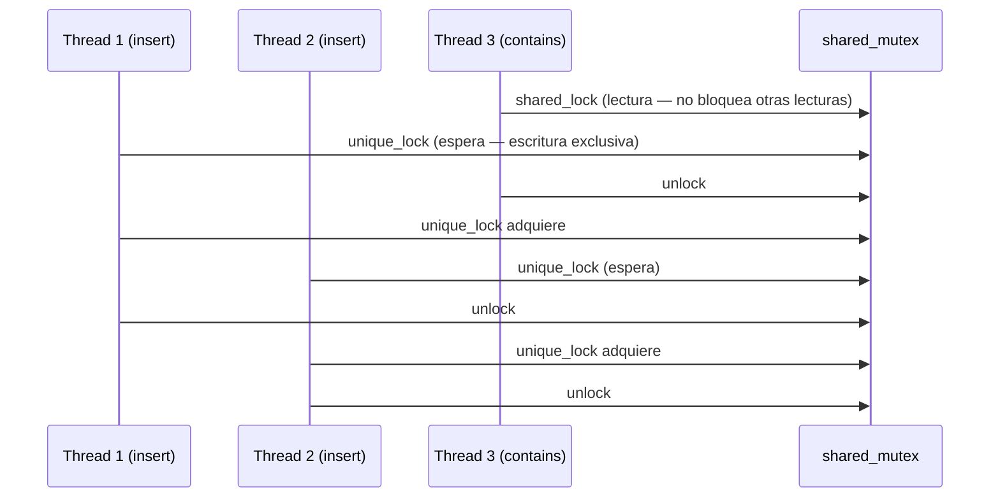
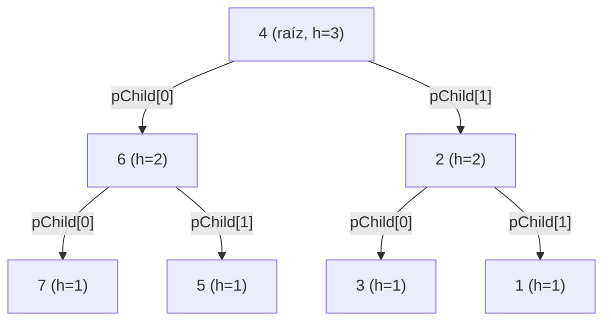

# PR — BinaryTree & BinaryTreeAVL

**Curso:** CC0E5-A — Algoritmos y Estructura de Datos Avanzados  
**Rama:** `21-BinaryTree`  
**Autor:** JaocHatter  
**Fecha:** 2026-05-18

---

## Descripción

Implementación completa de un árbol binario de búsqueda genérico (`BinaryTree<Trait>`) y su variante autobalanceada (`BinaryTreeAVL<Trait>`), con soporte para 6 tipos de iteradores DFS, concurrencia con `shared_mutex`, y persistencia mediante `operator<<` / `operator>>`.

---

## Archivos modificados / creados

| Archivo | Estado | Descripción |
|---|---|---|
| `containers/BinaryTree.h` | Modificado | Implementación completa del BST genérico con todos los iteradores |
| `containers/BinaryTreeAVL.h` | Nuevo | Árbol AVL heredando de `BinaryTree` con rotaciones automáticas |
| `containers/traits.h` | Modificado | Agrega `std::less` / `std::greater` como comparadores por defecto |
| `containers/general_iterator.h` | Modificado | Agrega `operator!=` necesario para range-based for |
| `containers/BinaryTreeDemo.cpp` | Nuevo | Demo y tests de integración con todos los iteradores y concurrencia |
| `main.cpp` | Modificado | Llama a `BinaryTreeDemo()` |

---

## Arquitectura general



---

## Diseño del nodo — CRTP

El problema con herencia clásica: si `AVLNode` heredara de `BinaryTreeNode<T>`, el array `m_pChild[2]` sería de tipo `BinaryTreeNode<T>*`, generando error de conversión al pasar nodos AVL a funciones que esperan `AVLNode*`.

**Solución — CRTP (Curiously Recurring Template Pattern):** cada tipo de nodo pasa su propio tipo como `Derived`, por lo que `m_pChild[2]` ya tiene el tipo exacto correcto sin ningún cast.

```cpp
template<typename Derived, typename T>
struct BinaryTreeNodeBase {
    Derived* m_pChild[2];  // tipo exacto sin cast
};

struct BinaryTreeNode<T> : BinaryTreeNodeBase<BinaryTreeNode<T>, T> {};
struct AVLNode<T>        : BinaryTreeNodeBase<AVLNode<T>, T> { int m_height; };
```

---

## Constructor copia

Clona recursivamente todos los nodos del árbol fuente creando una estructura completamente independiente. Adquiere `shared_lock` sobre el árbol origen para garantizar lectura segura en entornos concurrentes.

```cpp
BinaryTree(const BinaryTree& other) : m_pRoot(nullptr), m_size(0) {
    shared_lock lock(other.m_mtx);
    m_pRoot = internal_copy(other.m_pRoot);
    m_size  = other.m_size;
}
```

`internal_copy` recorre en preorder creando un nodo nuevo por cada nodo fuente, copiando ambos subárboles recursivamente.

---

## Move constructor

Transfiere la propiedad del árbol origen al nuevo objeto sin copiar ningún nodo. Deja el árbol origen en estado válido pero vacío usando `std::exchange`.

```cpp
BinaryTree(BinaryTree&& other) : m_pRoot(nullptr), m_size(0) {
    unique_lock lock(other.m_mtx);
    m_pRoot = exchange(other.m_pRoot, nullptr);
    m_size  = exchange(other.m_size, 0);
}
```

---

## Destructor seguro

Libera toda la memoria del árbol con un recorrido postorder: primero se eliminan los hijos y luego el nodo padre, evitando fugas de memoria y accesos a punteros inválidos.

```cpp
~BinaryTree() { internal_destroy(m_pRoot); }

void internal_destroy(Node* node) {
    if (!node) return;
    internal_destroy(node->m_pChild[0]);
    internal_destroy(node->m_pChild[1]);
    delete node;
}
```

---

## Iterador inorder forward

Recorre el árbol de izquierda a derecha usando un stack. En cada paso avanza al nodo más a la izquierda disponible, luego sube y explora el subárbol derecho.

Con `AscendingTrait` los valores mayores van a `pChild[0]`, por lo que el recorrido produce orden **descendente**. Con `DescendingTrait` produce orden **ascendente**.

```cpp
// Resultado con {5,3,7,1,4,6,8} — AscendingBSTrait:
// inorder forward: 8 7 6 5 4 3 1
```

---

## Iterador inorder backward

Recorre el árbol de derecha a izquierda aplicando la misma lógica de stack pero empujando siempre hacia `pChild[1]` primero.

```cpp
// inorder backward: 1 3 4 5 6 7 8
```

---

## Uso en range-based for

Se agregó `operator!=` a `general_iterator` para habilitar la sintaxis nativa de C++. `begin()` y `end()` devuelven el iterador inorder forward.

```cpp
for (auto& v : tree)
    cout << v << " ";
// salida: 8 7 6 5 4 3 1
```

También se expone `ForEach` que acepta lambdas y argumentos adicionales:

```cpp
tree.ForEach([](int& v) { cout << v << " "; });
```

---

## ToString

Genera la representación del árbol en formato `[v1,v2,...,vN]` recorriendo en inorder forward. Los valores se separan por coma sin espacios.

```cpp
string ToString() const;
// "[8,7,6,5,4,3,1]"
```

---

## operator<< — persistencia a archivos

`operator<<` delega en `ToString()` permitiendo imprimir el árbol tanto en consola como en archivos de texto.

```cpp
// Consola:
cout << tree;              // [8,7,6,5,4,3,1]

// Archivo:
ofstream f("arbol.txt");
f << tree;                 // escribe [8,7,6,5,4,3,1] al disco
```

---

## operator>>

Parsea el formato `[v1,v2,...,vN]` re-insertando cada valor en el árbol. Maneja correctamente las comas y corchetes como delimitadores.

```cpp
BinaryTree<AscendingBSTrait<int>> loaded;
ifstream fin("arbol.txt");
fin >> loaded;
// árbol reconstruido con los mismos valores
```

> **Nota:** Re-insertar valores en orden inorder produce un árbol degenerado (cadena). El formato preserva los datos, no la estructura topológica.

---

## Concurrencia

Todas las operaciones de escritura (`insert`, `remove`) adquieren `unique_lock` y las de lectura (`contains`, `size`, `height`, `ToString`) adquieren `shared_lock`, permitiendo lecturas concurrentes sin bloqueo mutuo.



**Test:** 5 threads × 1000 inserciones → `size=5000 → EXITO`

---

## Iterador preorder forward

Visita cada nodo antes que sus hijos usando un stack. Empuja primero el hijo derecho para que el izquierdo sea procesado primero.

```cpp
// preorder forward: 5 7 8 6 3 4 1
```

---

## Iterador preorder backward

Recorre en preorder pero invirtiendo el orden de visita: recoge todos los nodos en un `vector` durante la construcción y los recorre de atrás hacia adelante con un índice.

```cpp
// preorder backward: 1 4 3 6 8 7 5
```

---

## Iterador postorder forward

Usa dos stacks: el primero genera el orden inverso de postorder (raíz→der→izq), el segundo invierte ese resultado. El stack final entrega los nodos en orden postorder correcto (izq→der→raíz).

```cpp
// postorder forward: 8 6 7 4 1 3 5
```

---

## Iterador postorder backward

Recorre en orden raíz→izq→der usando un stack, empujando primero el hijo derecho y luego el izquierdo en cada paso.

```cpp
// postorder backward: 5 3 1 4 7 6 8
```

---

## Mejora libre 1 — `contains` y `remove`

**`contains`:** recorre el árbol sin recursión (iterativo), comparando con el comparador del trait. Costo O(h).

**`remove`:** maneja los tres casos clásicos de eliminación en BST. Cuando el nodo tiene dos hijos, lo reemplaza con su sucesor inorder (el mínimo del subárbol derecho) para mantener la propiedad BST.

```
remove(3) con árbol {5,3,7,1,4,6,8}:
  sucesor de 3 = mínimo de subárbol derecho de 3 = 4
  → nodo 3 se reemplaza con 4, se elimina el nodo 4 original
resultado: [8,7,6,5,4,1]
```

---

## Mejora libre 2 — `height` y `balance_factor`

**`height`:** calcula la altura del árbol recursivamente como `1 + max(height(izq), height(der))`.

**`balance_factor(node)`:** retorna `height(pChild[0]) - height(pChild[1])` para cualquier nodo. Si se pasa `nullptr`, usa la raíz.

```cpp
cout << tree.height();              // 3
cout << tree.balance_factor(nullptr); // 0 (árbol balanceado)
```

---

## Adaptar insert de BinaryTree — AVL

`BinaryTreeAVL` sobreescribe `insert` para ejecutar rotaciones automáticas después de cada inserción. La lógica detecta cuatro casos de desbalance (`bf = height(izq) - height(der)`):

| Caso | Condición | Corrección |
|---|---|---|
| LL | `bf > 1` y dato va a izquierda de hijo izq | `rotate_right(node)` |
| RR | `bf < -1` y dato va a derecha de hijo der | `rotate_left(node)` |
| LR | `bf > 1` y dato va a derecha de hijo izq | `rotate_left(hijo)` → `rotate_right(node)` |
| RL | `bf < -1` y dato va a izquierda de hijo der | `rotate_right(hijo)` → `rotate_left(node)` |



Insertar `{1,2,3,4,5,6,7}` en BST puro genera altura 7. El AVL lo reduce a **altura 3**.

---

## Extender BinaryTreeNode para tener la altura — AVLNode

`AVLNode<T>` hereda de `BinaryTreeNodeBase` (CRTP) y agrega el campo `m_height`, inicializado en `1` al crear el nodo. Se actualiza después de cada rotación con:

```cpp
template<typename T>
struct AVLNode : BinaryTreeNodeBase<AVLNode<T>, T> {
    int m_height;
    AVLNode(T data) : BinaryTreeNodeBase<AVLNode<T>, T>(data), m_height(1) {}
};

void update_height(Node* n) {
    if (n) n->m_height = 1 + max(node_height(n->m_pChild[0]),
                                  node_height(n->m_pChild[1]));
}
```

Los traits `AscendingAVLTrait<T>` y `DescendingAVLTrait<T>` son alias que conectan `AVLNode<T>` con los comparadores de `traits.h`.

---

## Resultado de la demo

```
=== BinaryTree Demo ===
BST inorder (forward): [8,7,6,5,4,3,1]
Size: 7  |  Height: 3
range-for:       8 7 6 5 4 3 1
ForEach:         8 7 6 5 4 3 1
backward:        1 3 4 5 6 7 8
preorder:        5 7 8 6 3 4 1
pre-back:        1 4 3 6 8 7 5
postorder:       8 6 7 4 1 3 5
post-back:       5 3 1 4 7 6 8
contains(7): true  |  contains(9): false
After remove(3): [8,7,6,5,4,1]
Copy ctor:       [8,7,6,5,4,1]
Move ctor:       [8,7,6,5,4,1]

--- Concurrency test (5 threads x 1000 inserts) ---
size=5000 (expected 5000) -> EXITO

=== AVL Demo ===
AVL inorder:      [7,6,5,4,3,2,1]   Height: 3 (esperado <= 3)
AVL desc inorder: [1,2,3,4,5,6,7]   Height: 3 (esperado <= 3)
```

---

## Checklist

| # | Requerimiento | Estado |
|---|---|---|
| — | Descripción del PR con diagrama Mermaid | ✅ |
| 1 | Constructor copia | ✅ |
| 2 | Move constructor | ✅ |
| 3 | Destructor seguro | ✅ |
| 4 | Iterador inorder forward | ✅ |
| 5 | Iterador inorder backward | ✅ |
| 6 | Uso en range-based for | ✅ |
| 7 | `ToString` | ✅ |
| 8 | `operator<<` con persistencia a archivos | ✅ |
| 9 | `operator>>` | ✅ |
| 10 | Concurrencia (`shared_mutex`) | ✅ |
| 11 | Iterador preorder forward | ✅ |
| 12 | Iterador preorder backward | ✅ |
| 13 | Iterador postorder forward | ✅ |
| 14 | Iterador postorder backward | ✅ |
| 15 | Mejora libre: `contains` y `remove` | ✅ |
| 16 | Mejora libre: `height` y `balance_factor` | ✅ |
| AVL-1 | Adaptar `insert` de `BinaryTree` para AVL | ✅ |
| AVL-2 | Extender `BinaryTreeNode` con campo altura | ✅ |